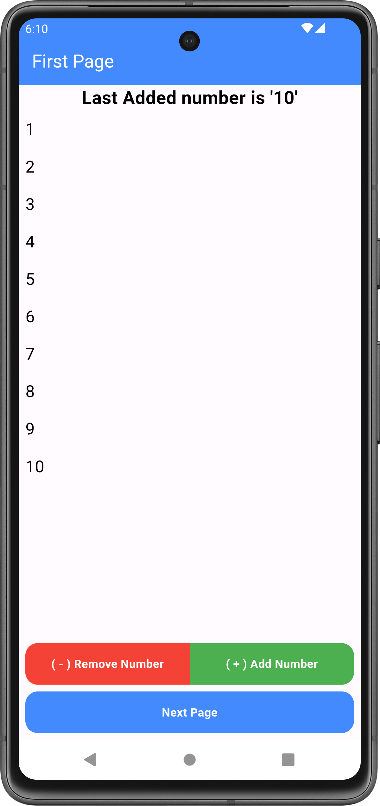
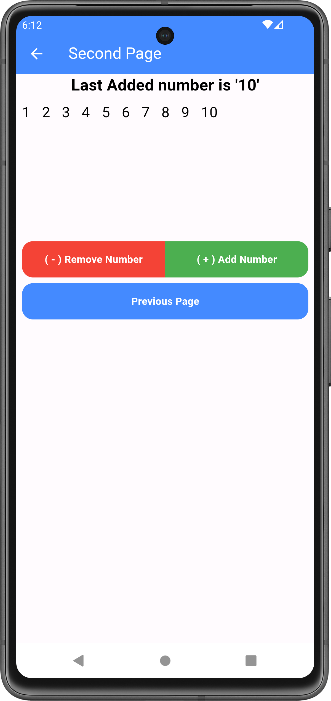
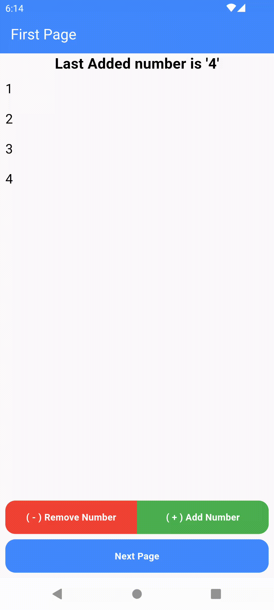

# Provider Practice App in Flutter

This project is a practice app demonstrating state management in Flutter using the `provider` package. The app consists of two screens where users can add or remove numbers from a list, and the state is managed across both screens using Provider.

## Importance of State Management in Flutter

State management is crucial in Flutter for maintaining the state of an application, ensuring that the UI reflects the current data, and allowing for a seamless user experience. In Flutter, state management can be achieved through various approaches, with Provider being one of the most popular and recommended solutions.

## Provider in Flutter

The `provider` package is a wrapper around InheritedWidget, making it easier to manage and propagate state changes throughout the application. It simplifies the process of accessing shared data and updating the UI in response to state changes.

### Use Cases of Provider

- **Simplifies State Management**: Provider makes it easy to manage the state of your application, ensuring that your UI remains in sync with the underlying data.
- **Efficient Data Propagation**: Changes in the state are efficiently propagated to all the widgets that depend on it.
- **Scoped State Management**: Provider allows you to scope the state to specific parts of the widget tree, reducing the risk of unintentional side effects.

## App Functionality

### Screen 1

- **Add Number**: Increments a number in a prefilled list.
- **Remove Number**: Decrements a number in the list.
- **Next Page**: Navigates to the second screen.

### Screen 2

- **Add Number**: Increments a number in the list.
- **Remove Number**: Decrements a number in the list.
- **Back to Previous Page**: Navigates back to the first screen.

Both screens share the same state. Any action performed on one screen will automatically update the state on the other screen, ensuring consistency across the app.

## Screenshots and GIF

| Screen 1                          | Screen 2                           | Demo                               |
|-----------------------------------|------------------------------------|------------------------------------|
|  |  |  |

## Enjoy coding! 🎉

